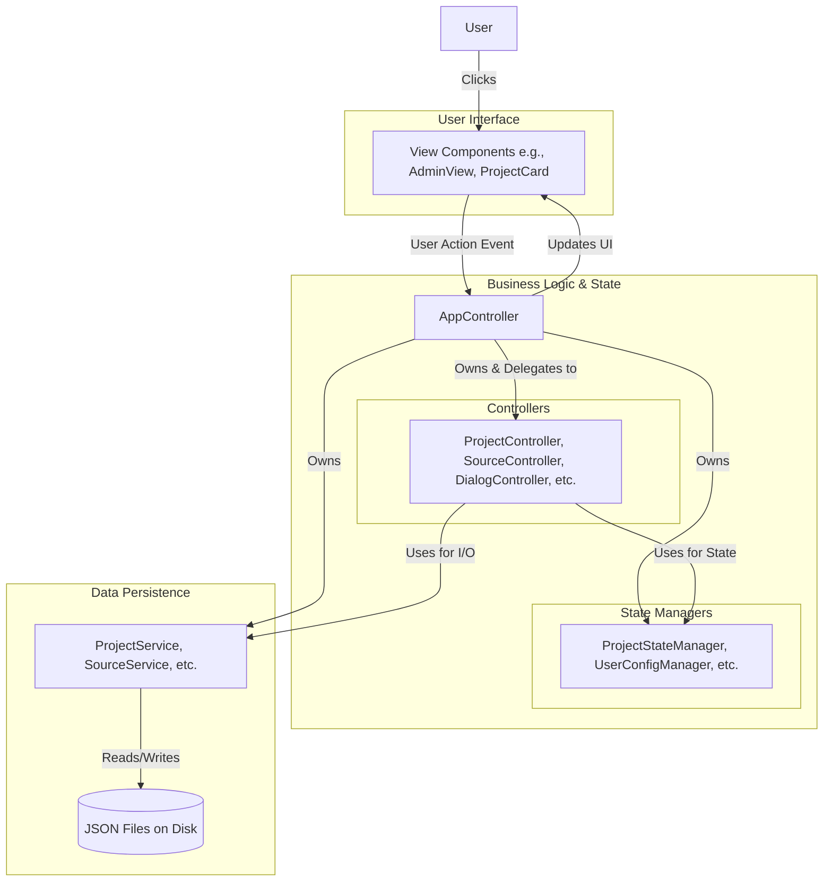
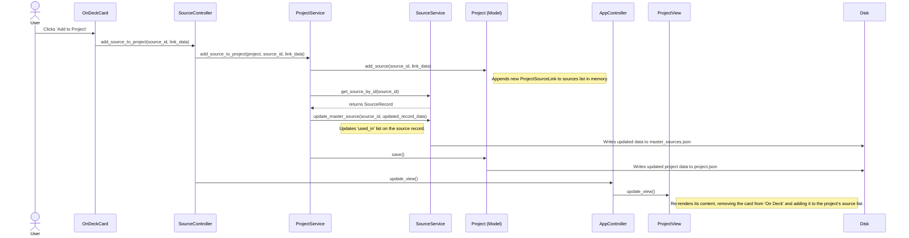

# Source Manager 2.0 - Technical Documentation

## 1. Introduction

Source Manager 2.0 is a desktop application built with the Flet framework for Python. Its primary purpose is to provide a robust system for managing, citing, and exporting bibliographic sources for various projects, particularly reports and presentations.

The application is designed with a highly modular and extensible architecture, allowing for dynamic configuration of data types (sources, projects) and a clear separation of concerns between the user interface, business logic, and data persistence.

### 1.1. Core Architectural Pattern

The application follows a variation of the **Model-View-Controller (MVC)** pattern, adapted for a Flet environment. It can be more accurately described as **MVC-S+M (Model-View-Controller-Service + Manager)**.

-   **Model (`/src/models`)**: Defines the data structures of the application (e.g., `Project`, `SourceRecord`, `UserConfig`). These are primarily Python `dataclasses` responsible for their own serialization and deserialization.
-   **View (`/src/views`)**: Contains all Flet UI components. This layer is responsible for displaying data and capturing user input. It should contain minimal business logic, delegating actions to the Controller.
-   **Controller (`/src/controllers`)**: Acts as the central nervous system. It receives events from the View, processes them by interacting with Services and Managers, and updates the View accordingly. The `AppController` is the main orchestrator, which delegates tasks to specialized sub-controllers (e.g., `ProjectController`, `AdminController`).
-   **Service (`/src/services`)**: Handles all external interactions, primarily file I/O. Services are responsible for reading from and writing to JSON files, abstracting the persistence layer from the rest of the application.
-   **Manager (`/src/managers`)**: Manages application state and complex logic that doesn't fit neatly into a standard Controller/Service pattern (e.g., `NavigationManager`, `ThemeManager`, `UserConfigManager`).
-   **UI Inheritance**: The application uses base classes like `BaseView` and `BaseCard` to ensure a consistent look, feel, and structure for UI components. This promotes code reuse and simplifies the creation of new UI elements.

---

## 2. Developer Setup Guide

This guide provides step-by-step instructions for setting up the development environment for Source Manager 2.0.

1.  **Prerequisites**:
    -   Git
    -   Conda (Miniconda or Anaconda)

2.  **Clone the Repository**:
    ```bash
    git clone <repository_url>
    cd source_manager_flet
    ```

3.  **Create and Activate Conda Environment**:
    The project includes an `environment.yml` file to ensure a consistent development environment.
    ```bash
    conda env create -f environment.yml
    conda activate sm_flet
    ```

4.  **Run the Application**:
    A convenience script `runflet` is provided in the project root to handle environment activation and running the Flet application.
    ```bash
    ./runflet
    ```
    Alternatively, you can run it manually after activating the environment:
    ```bash
    flet run
    ```

5.  **Initial Setup**:
    On the first run, the application will create necessary configuration files in the `program_files` directory. You will be prompted to create a display name. The default admin password is `admin123`, which should be changed immediately for security.
---

## 2. Architectural Deep Dive

### 2.1. Component Responsibilities

#### Controllers (`/src/controllers`)
Controllers are the "brains" of the operation. They respond to user actions from the View and orchestrate the necessary calls to Managers and Services to fulfill the request.

-   **`AppController`**: The singleton orchestrator. It owns instances of all other controllers, managers, and services. It handles top-level concerns like navigation requests and displaying global messages (SnackBars).
-   **`NavigationController`**: Manages the logic of switching between views. It holds the view cache, handles special routing cases (e.g., `project_view` alias), and manages the admin authentication gate.
-   **`DialogController`**: A factory and controller for all modal dialogs. It centralizes the logic for opening dialogs and defining their `on_success` callback functions, keeping the views clean.
-   **`ProjectController`**: Handles business logic related to the lifecycle of a project (creating, opening, updating metadata).
-   **`SourceController`**: Handles business logic for sources (creating master records, linking them to projects).
-   **`AdminController`**: Contains all logic for the Admin panel, such as creating/updating/deleting users and configuration types.

#### Managers (`/src/managers`)
Managers are responsible for holding and managing *state*. While a Controller processes a one-time event, a Manager maintains a state that can be accessed by multiple components over time.

-   **`ProjectStateManager`**: Its primary job is to hold the `current_project` object in memory. This provides a single, authoritative source for the currently loaded project's data for all parts of the UI.
-   **`UserConfigManager` / `SettingsManager`**: These two work in tandem. `UserConfigManager` is a low-level manager responsible for the physical loading and saving of the user's `.json` file. `SettingsManager` provides a higher-level, more logical interface for accessing and modifying those settings (e.g., `toggle_theme_mode`). This separation is a good example of the Single Responsibility Principle.
-   **`ThemeManager`**: Holds the *active* theme data in memory. It's responsible for generating the Flet `Theme` object that gets applied to the page. It is controlled by the `SettingsManager`.
-   **`NavigationManager`**: A simple state machine that tracks the `current_page` and `previous_page`. This is useful for "Back" button logic.

#### Services (`/src/services`)
Services are the application's interface to the outside world. Their only job is to perform I/O operations, primarily reading from and writing to the file system. They should contain no complex business logic.

-   **`ProjectService`**: Performs CRUD (Create, Read, Update, Delete) operations on project `.json` files.
-   **`SourceService`**: Performs CRUD operations on the master source files (e.g., `USA_sources.json`). It also contains the in-memory cache for these files to reduce disk reads.
-   **`AdminService`**: Responsible for loading and saving the `source_types.json` and `project_types.json` configuration files.
-   **`AdminAuthService`**: Manages the `admin_config.json` file and the individual user config files (`jim.json`, etc.) for authentication and user management purposes.

### 2.2. Component Ownership Diagram

This diagram illustrates the high-level ownership and relationship between the core architectural components. It shows how the `AppController` acts as the central hub. The user interacts with the View, which triggers a Controller. The Controller uses Managers for state and Services for data, then updates the View.



### 2.3. Example Interaction Sequence Diagram

This sequence diagram provides an exhaustive, step-by-step trace of a critical user action: **adding an existing source to a project**. It shows the precise method calls between components, from the UI event to the final data persistence on disk.



---

## 3. Data Model & Persistence

Understanding the flow of data and the relationships between the core models is key to understanding the application.

### 3.1. Key Data Models

-   **`Project` (`project_models.py`)**: Represents a single project file (e.g., `MyReport.json`). It contains project-level metadata (`project_title`, `project_type`) and a list of `ProjectSourceLink` objects. It does **not** contain the full source data itself.
-   **`SourceRecord` (`source_models.py`)**: Represents a single, canonical master source in the library. It contains all the "core" metadata for a source (e.g., author, publication year) and is stored in a country-specific master file (e.g., `USA_sources.json`).
-   **`ProjectSourceLink` (`project_models.py`)**: The crucial link between a `Project` and a `SourceRecord`. It contains the `source_id` of the master record and a `metadata` dictionary for any project-specific information (e.g., `usage_notes`). This prevents data duplication.
-   **`UserConfig` (`user_config_models.py`)**: Stores all settings for a specific user, identified by their username (e.g., `jim.json`). This includes window size, theme, recent projects, and their role/permissions.

### 3.2. Configuration-Driven UI

A major strength of this application is its dynamic nature. The fields available for a given `Source Type` or `Project Type` are not hardcoded. They are defined in two central configuration files:

-   `program_files/config/source_types.json`
-   `program_files/config/project_types.json`

The **Admin View** provides a UI to modify these files. When a user creates or edits a source/project, the application reads the corresponding configuration to dynamically build the form with the correct fields, validation rules, and UI elements. This makes the application extremely adaptable to new requirements without changing the core Python code.

### 3.3. Example Data Flow: Adding a Source to a Project

1.  **User Action**: The user is in the `ProjectView`, on the `ProjectSources` tab, and clicks the "Add Source" button on an `OnDeckCard`.
2.  **View -> Controller**: The `on_click` event in `OnDeckCard` calls `self.controller.source_controller.add_source_to_project(source_id, link_data)`.
3.  **Controller -> Service**: The `SourceController` receives the request. It calls the `ProjectService.add_source_to_project()` method, passing the current project object, the source ID, and any project-specific link data collected from the dialog.
4.  **Service (Business Logic)**:
    -   The `ProjectService` adds a new `ProjectSourceLink` to the `project.sources` list.
    -   It then calls `SourceService.get_source_by_id()` to fetch the master `SourceRecord`.
    -   It updates the `used_in` list on the `SourceRecord` to track that it's now used by this project.
    -   It calls `SourceService.update_master_source()` to save the change to the master source file (e.g., `USA_sources.json`).
    -   Finally, it calls `project.save()` to write the updated project data (with the new `ProjectSourceLink`) back to its own file (e.g., `MyReport.json`).
5.  **Controller -> View**: After the services complete, the `SourceController` calls `self.controller.update_view()`, which triggers the `update_view()` method on the active `ProjectView`, causing it to refresh and display the newly added source.

---
### 3.4. Example Data Flow: Application Startup and Project Loading

1.  **Initialization**: `main.py` instantiates and runs `AppController`.
2.  **Service/Manager Loading**: The `AppController` constructor initializes all services and managers.
    -   `UserConfigManager` loads the current user's config file (e.g., `jim.json`) into memory.
    -   `AdminService` loads `source_types.json` and `project_types.json` into memory. If they don't exist, it creates default empty versions.
    -   `SourceService` initializes its cache but does not load any master source files yet (lazy loading).
3.  **UI Launch**: `AppController.run()` applies the user's theme from the loaded `UserConfig` and navigates to the `home` page.
4.  **User Action**: The user clicks on a project in the "Recent Projects" list.
5.  **View -> Controller**: The `on_click` event calls `ProjectController.open_project(project_path)`.
6.  **Controller -> Service**: The `ProjectController` delegates to `ProjectService.load_project(project_path)`.
7.  **Service -> Model**: The `ProjectService` reads the project's JSON file. The raw dictionary is passed to `Project.from_dict()` to be deserialized into a `Project` object.
8.  **Controller -> Manager**: The loaded `Project` object is passed to `ProjectStateManager.load_project()`, which stores it as the `current_project`.
9.  **State Management**: `AppController.clear_project_dependent_view_cache()` is called to ensure views like the dashboard are rebuilt with the new project's data.
10. **Navigation**: `NavigationController.navigate_to_page('project_dashboard')` is called. It finds the `ProjectView` class, instantiates it, and sets it as the main content.
11. **View Rendering**: The `ProjectView` and its child tabs (e.g., `ProjectMetadataTab`) are built. They pull data from the `ProjectStateManager` and various controllers to render the UI for the newly loaded project.

---

### 3.5. Data File Schemas

Understanding the structure of the JSON configuration files is essential for extending the application.

#### `source_types.json`

This file defines the available types of sources and the fields associated with each.

```json
{
  "SOURCE_TYPES_CONFIG": {
    "book": {
      "display_order": 0,
      "citation_format": "{authors} ({publication_year}). {title}.",
      "fields": [
        {
          "name": "authors",
          "label": "Author(s)",
          "field_type": "text",
          "required": true,
          "storage_scope": "core"
        },
        {
          "name": "usage_notes",
          "label": "Usage Notes",
          "field_type": "textarea",
          "storage_scope": "link"
        }
      ]
    }
  }
}
```

-   **`display_order`**: Controls the sort order in UI lists.
-   **`citation_format`**: An f-string-like template used by the `citation_generator`. Placeholders correspond to the `name` of a field.
-   **`fields`**: A list of field definitions.
    -   **`storage_scope`**: A critical key. `"core"` means the data is saved in the master `SourceRecord`. `"link"` means the data is project-specific and saved in the `ProjectSourceLink`'s metadata.

#### `project_types.json`

This file defines the available types of projects and their associated metadata fields.

```json
{
  "PROJECT_TYPES_CONFIG": {
    "STD": {
      "display_name": "Standard Report",
      "description": "A standard project type.",
      "filename_pattern": "{project_title} - {current_year}",
      "display_order": 0,
      "fields": [
        {
          "name": "project_title",
          "label": "Project Title",
          "field_type": "text",
          "required": true,
          "collection_stage": "dialog"
        },
        {
          "name": "team_lead",
          "label": "Team Lead",
          "field_type": "text",
          "collection_stage": "metadata_tab",
          "column_group": "Team"
        }
      ]
    }
  }
}
```

-   **`filename_pattern`**: An f-string-like template for generating the project's JSON filename.
-   **`fields`**: A list of field definitions.
    -   **`collection_stage`**: Determines where the field is collected. `"dialog"` appears in the initial creation dialog. `"metadata_tab"` appears on the editable metadata tab inside the project.
    -   **`column_group`**: Used by the `ProjectMetadataTab` to group fields into UI columns.

#### `user_config.json` (e.g., `jim.json`)

This file stores all preferences and state for a single user.

```json
{
    "window": {
        "width": 1900,
        "height": 900,
        "x": null,
        "y": null,
        "maximized": false
    },
    "theme": {
        "mode": "dark",
        "color": "blue"
    },
    "display_name": "Jim",
    "setup_completed": true,
    "recent_projects": [
        {
            "display_name": "Sample Project",
            "path": "/path/to/project.json"
        }
    ],
    "last_page": "home",
    "role": "admin",
    "is_active": true
}
```

#### `master_source.json` (e.g., `USA_sources.json`)

This file is a container for all master source records for a given country.

```json
{
    "sources": [
        {
            "id": "7ca84b7c-f237-423b-9cc9-c9f62822b6b0",
            "source_type": "book",
            "country": "USA",
            "display_name": "The Art of Software",
            "date_created": "2025-09-10T16:00:00.000000",
            "last_modified": "2025-09-10T16:00:00.000000",
            "used_in": [
                { "project_id": "...", "project_title": "..." }
            ],
            "authors": ["John Doe"],
            "publication_year": "2025"
        }
    ]
}
```

---

## 4. UI Component Library

A brief overview of the primary UI components and their roles.

### 4.1. Pages (`/src/views/pages`)

-   **`MainView`**: The root UI control that contains the `AppBar`, `Sidebar`, and the main `content_area`. It orchestrates the overall layout.
-   **`HomeView`**: The application's landing page, providing quick navigation actions.
-   **`NewProjectView`**: A file-browser-like interface for navigating the project directory and creating new projects or folders.
-   **`RecentProjectsView`**: Displays a list of recently opened projects for quick access.
-   **`ProjectView`**: The main dashboard for an open project. It contains tabs for metadata, sources, and other project-related information.
-   **`SourcesView`**: A view for searching and filtering the entire master source library. Allows users to add sources to the "On Deck" list of the current project.
-   **`AdminView`**: A tabbed interface for managing application configurations, including Source Types, Project Types, and Users.


### 4.2. Reusable Components (`/src/views/components`)

-   **`ProjectSourceCard`**: Displays a source that has been added to the current project. Includes actions to edit or remove the source from the project.
-   **`OnDeckCard`**: Displays a source in the "On Deck" list or in the master source library. Includes actions to add the source to a project or view its details.
-   **`SourceCreationDialog` / `SourceEditorDialog`**: Dynamically generated forms for creating and editing sources based on the `source_types.json` configuration.
-   **`UserEditorDialog`**: A dialog for creating or editing user profiles (name, role, active status).

---
## 5. Special Tools

### 5.1. Legacy Source Migration Tool

The application includes a specialized tool to assist in migrating legacy project files to the new, structured format.

-   **Location**: `Admin View` -> `Legacy Migration` Tab.
-   **Purpose**: To convert sources stored as simple string dictionaries (e.g., `{"citation": "...", "comment": "..."}`) into new, structured `SourceRecord` and `ProjectSourceLink` objects.

#### Workflow

1.  **Select File**: The user selects a legacy project `.json` file using the "Select Project File" button. The application automatically creates a backup (`.json.bak`) of the original file.
2.  **Load Source**: The tool loads the first unprocessed legacy source from the file.
3.  **Display Data**:
    -   The **left panel** displays the raw, un-parsed `citation` and `comment` strings for review.
    -   The **right panel** displays a dynamic form, similar to the source creation dialog.
4.  **Automatic Parsing**: The application attempts to automatically parse the citation string and pre-populate fields in the form on the right.
    -   **Developer Action**: The custom parsing logic must be added by the developer in `src/controllers/migration_controller.py` within the `parse_legacy_source` method. A `TODO` block clearly marks the integration point.
5.  **Manual Correction**: The user reviews the pre-populated data, selects the correct `Country` and `Source Type`, and makes any necessary manual corrections in the form.
6.  **Save & Next**: Clicking "Save & Next" performs several actions:
    -   It creates a new `SourceRecord` in the appropriate master source file (e.g., `USA_sources.json`).
    -   It replaces the old dictionary in the project file's `sources` list with a new `ProjectSourceLink` pointing to the newly created master record.
    -   It saves the entire updated project file to disk.
    -   It automatically loads the next legacy source in the file for processing.
7.  **Navigation**: The user can navigate between legacy sources using the "Previous" and "Next" buttons.

This semi-automated process allows for rapid and accurate migration of hundreds of sources across many project files, with the safety net of manual verification.

## 5. Development Guide

### 5.1. Potential Optimizations

The codebase is well-structured, but as it scales, the following areas could be considered for optimization.

#### Asynchronous File Operations

-   **Observation**: Currently, all file I/O in the `services` layer is synchronous. If a user saves a very large project or the master source files grow significantly, this could cause the UI to freeze momentarily.
-   **Suggestion**: Refactor the `save` and `load` methods in `ProjectService` and `SourceService` to be `async`. Flet has excellent support for `asyncio`. These file operations could be run in a separate thread using `asyncio.to_thread`, preventing any blocking of the main UI thread and keeping the application responsive.

#### Caching Strategy

-   **Observation**: The `SourceService` implements a basic cache (`_master_source_cache`) for loaded country files, which is excellent. The `AdminService` loads configurations at startup and holds them in memory.
-   **Suggestion**: For the `AdminService`, consider implementing a "reload" mechanism. If the config files could be edited outside the application, the service currently wouldn't know. A "Reload Configuration" button in the admin panel could clear and re-run the `_load_or_create_config` methods, ensuring the UI reflects external changes without a full restart.

#### Targeted UI Updates

-   **Observation**: The application correctly uses `controller.update_view()` to refresh specific views, which is more efficient than a full `page.update()`.
-   **Suggestion**: As the UI grows more complex, continue this pattern. For very large lists (e.g., hundreds of sources), consider implementing virtual scrolling or pagination. Instead of adding all `OnDeckCard` controls to a `ListView` at once, only add the visible ones and load more as the user scrolls. Flet's `ListView` has properties that can facilitate this (`on_scroll` event).

---

### 5.2. Security Vulnerabilities & Hardening

This section highlights critical areas that require attention to ensure the application is secure, especially if deployed in a multi-user or sensitive environment.

#### Admin Password Storage (High Severity)

-   **Vulnerability**: The `AdminAuthService` stores the admin password as a direct SHA-256 hash. While this is not plaintext, it is vulnerable to rainbow table attacks and is not considered a secure password storage standard.
-   **Recommendation**: **Immediately** upgrade the password hashing mechanism. Use a modern, salted, and key-stretching algorithm like **Argon2** (preferred) or **PBKDF2**. Libraries like `argon2-cffi` or Python's built-in `hashlib.pbkdf2_hmac` should be used.
    -   When a new password is set, generate a random salt.
    -   Combine the password and salt, and run it through the hashing algorithm for many iterations.
    -   Store the `salt` and the final `hash` together in the `admin_config.json`.
    -   During authentication, retrieve the user's salt and hash, and re-run the process with the provided password to see if the hashes match.
-   **Default Password**: The default password of "admin123" is a significant risk. The application should force the admin to change this password on their first login after a fresh setup.

#### User Data Management

-   **Observation**: The `AdminAuthService` currently uses the user's display name to form the filename (e.g., `jim.json`). When a user's name is updated, the file is renamed.
-   **Potential Issue**: While functional, this ties a mutable piece of data (display name) to an immutable identifier (the filename). If any other part of the system were to reference a user by their filename, a name change could break that link.
-   **Suggestion**: Consider a more robust user identification system.
    -   When a user is created, assign them a unique, immutable UUID, just like `SourceRecord` and `Project`.
    -   The user's config file could be named `[UUID].json`.
    -   A separate, simple index file (e.g., `user_index.json`) could map usernames/display names to their corresponding UUID file. This decouples the user's identity from their mutable display name. The current approach is acceptable for a small, single-machine application but this change would improve scalability and robustness.

#### Error Handling and Logging

-   **Observation**: The application has good `try...except` blocks and logging in most service methods.
-   **Recommendation**: Continue this practice. Ensure that no sensitive information (like passwords or full file paths from user input) is ever logged in plaintext. The current logging appears to be safe in this regard.

---

## 6. Conclusion & Future Work

Source Manager 2.0 is a well-architected application with a strong foundation. Its separation of concerns and configuration-driven design make it flexible and maintainable.

The immediate priorities for future development should be **security hardening**, particularly addressing the password storage. Following that, focusing on asynchronous operations and further refining the UI update strategy will ensure the application remains fast and responsive as it grows in scale and complexity.